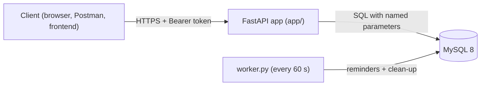
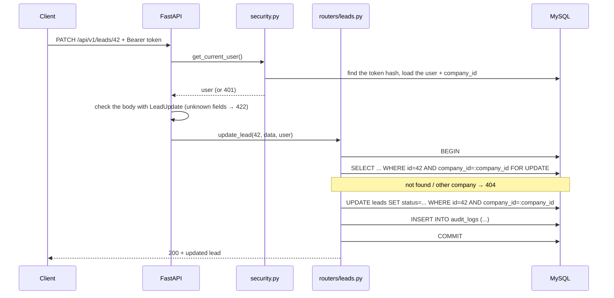
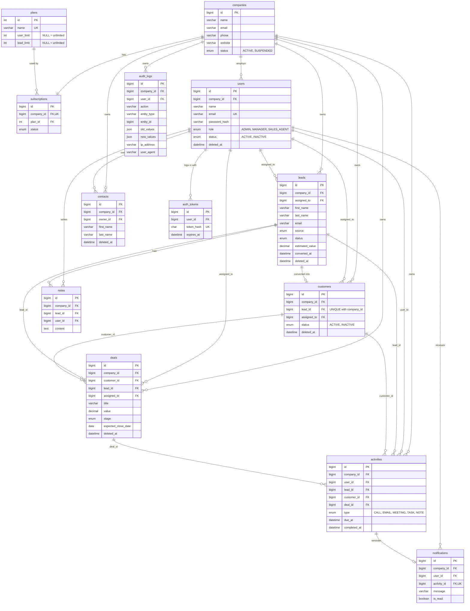

# Architecture

## Overview



Three parts:

1. **API** (`app/`): a FastAPI app. It has no state of its own, so you can run several copies behind a load balancer.
2. **MySQL**: stores all data, the login tokens and the rate-limit counters.
3. **Worker** (`worker.py`): a separate process that runs background jobs every minute.

## What happens during a request

Example: `PATCH /api/v1/leads/42` with `{"status": "QUALIFIED"}`.



## Code layers

| Layer | Files | Job |
| --- | --- | --- |
| Routers | `app/routers/*.py` | one file per feature. Reads the request, checks permissions, runs the SQL in a transaction |
| Schemas | `app/schemas/*.py` | Pydantic models. What a request may contain (`extra="forbid"`) and what a response shows |
| Security | `app/security.py` | password hashing, tokens, `get_current_user`, `allow_roles(...)` |
| Tenant-safe lookups | `app/finders.py` | the only way to load one lead/customer/contact/deal/activity. Always adds the company filter |
| Shared helpers | `app/utils.py`, `app/plan_limits.py`, `app/audit.py`, `app/rate_limit.py` | pagination, updates, plan limits, audit log, rate limit |
| Errors | `app/errors.py` | turns errors into clean JSON (401/403/404/409/422/429/500) |
| Jobs | `app/jobs.py`, `worker.py` | background work |

I kept the business logic in the routers instead of adding a separate "service" layer.
The project is small enough that this is easier to read. If it grew, the first step
would be to move bigger flows (like lead conversion) into `app/services/`.

Every change that writes data uses `with engine.begin() as db:`. That block is **one
transaction**: MySQL saves everything inside it together at the end, or undoes all of it
if an error happens. The audit log is written inside the same transaction, so a change
without its audit log (or the other way round) cannot happen.

## Database ERD



(`rate_limits` and `schema_migrations` are small helper tables without relations.
All tables also have `created_at` / `updated_at`.)

### Why the foreign keys use two columns

Each tenant table has `UNIQUE (company_id, id)`. Other tables then point at it with **both**
columns, for example:

```sql
FOREIGN KEY (company_id, assigned_to) REFERENCES users (company_id, id)
```

This means "the assigned user must be in the **same company** as the lead". MySQL checks
it, so even a bug in the Python code could not link an Acme lead to a Globex user.

### Why these indexes

Every query starts with `WHERE company_id = ?`, so every index starts with `company_id`:

| Index | Used by |
| --- | --- |
| `leads (company_id, deleted_at, created_at)` | default lead list, sorted by newest |
| `leads (company_id, status)` | status filter, dashboard counts |
| `leads (company_id, assigned_to)` | a sales agent's own leads, `assigned_to` filter |
| `leads (company_id, email)` | looking up a lead by email |
| same pattern on contacts, customers, deals | their lists and filters |
| `deals (company_id, stage)` | pipeline and dashboard values |
| `activities (completed_at, due_at)` | reminder job ("unfinished and due soon") |
| `audit_logs (company_id, created_at)` | audit log list |
| `auth_tokens (token_hash)` unique | the token lookup that runs on every request |

## Background jobs

`worker.py` runs `app/jobs.py` every 60 seconds:

1. **Activity reminders:** finds unfinished activities due in the next 60 minutes that have
   no reminder yet, saves a row in `notifications` for the owner, and logs it. (A real
   system would send an email or push message here. The brief allows logging or storing it.)
2. **Clean-up:** deletes expired login tokens and old rate-limit counters.

**What happens when a job fails?**
- The loop catches the error, logs it, and tries again next minute. The worker does not crash.
- Each reminder is saved in its own small transaction, so a failure halfway only loses
  the unfinished part. The next run picks it up again.
- `notifications.activity_id` is `UNIQUE` and the insert is `INSERT IGNORE`, so running the
  job twice (or running two workers) never sends the same reminder twice.

With more load I would move this to a real queue (Redis + RQ or Celery) with retries and
a "dead letter" list for jobs that keep failing.

## Performance and scaling

Target from the brief: 10,000 companies, 1,000,000+ leads, 500,000+ customers, millions of activities.

**What the code already does**

- **Tenant-first indexes:** 1,000,000 leads across 10,000 companies is about 100 leads per
  company on average. The `(company_id, ...)` indexes let MySQL jump straight to one
  company's rows, so the total table size barely matters.
- **Pagination everywhere**, max 100 rows per page (larger requests get a 422).
- **No N+1 queries:** a list is exactly 2 queries (COUNT + one page). The dashboard is 3
  queries using `GROUP BY` and `SUM(CASE ...)`, not one query per status.
- **Short transactions:** slow work (password hashing) happens before the transaction
  starts, and row locks are only held for a few milliseconds.
- **Stateless API:** tokens and rate limits are in the database, so you can run many API
  copies behind a load balancer.

**What I would add as it grows (roughly in this order)**

1. **Redis** for rate limiting and for caching the dashboard for ~30 seconds per company/user.
2. **Keyset pagination** for deep pages: `WHERE (created_at, id) < (:last_created_at, :last_id)`
   instead of `OFFSET 100000`, which gets slow because MySQL has to skip all those rows.
3. **Better search:** `LIKE '%john%'` cannot use an index. With millions of rows I would
   use MySQL `FULLTEXT` indexes first, and later Meilisearch or OpenSearch (with the
   `company_id` filter on every search query).
4. **Read replicas:** send lists, search and the dashboard to replicas, and writes to the primary.
5. **A real job queue** (Redis + RQ/Celery) for reminders, CSV exports and webhooks.
6. **Audit log growth:** partition `audit_logs` by month, or move it to separate storage.
7. **From 100 to 100,000 companies:** the design already works per company, so the last
   step would be **sharding by `company_id`** (companies split over several MySQL servers,
   with a small lookup table saying which company lives where). Very large customers could
   get their own database.

## API versioning (v1 → v2)

- All routes are under `/api/v1` (the prefix is set on each router).
- For a breaking change, I would add new routers with the prefix `/api/v2` and include them
  in `app/main.py` next to v1. Both versions use the same database and the same helpers
  (`finders.py`, `security.py`), so only the request and response format differs.
- v1 keeps working unchanged. Its responses get a `Deprecation` / `Sunset` header, and the
  change is announced with an end date.
- v1 is only removed when the logs show nobody is calling it anymore.
- Non-breaking changes (a new optional field, a new endpoint) go into v1 directly.
